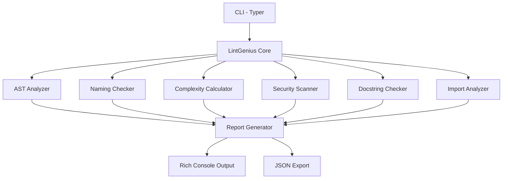

# LintGenius

[](https://github.com/officethree/LintGenius/actions/workflows/ci.yml)
[](https://www.python.org/downloads/)
[](LICENSE)
[](https://github.com/psf/black)

> AI-powered code review assistant that analyzes Python code for quality issues, suggests improvements, and generates review comments.

Inspired by AI coding assistants — but focused purely on **code review and linting**.

---

## Architecture



## Quickstart

### Installation

```bash
# Clone the repo
git clone https://github.com/officethree/LintGenius.git
cd LintGenius

# Install in development mode
pip install -e ".[dev]"
```

### Usage

```bash
# Analyze a single file
lintgenius analyze path/to/file.py

# Analyze with JSON output
lintgenius analyze path/to/file.py --format json

# Analyze an entire directory
lintgenius analyze src/ --recursive

# Show version
lintgenius --version
```

### Example Output

```
╭──────────────────── LintGenius Report ────────────────────╮
│ File: example.py                                          │
│ Quality Score: 72/100                                     │
│                                                           │
│  ⚠  WARN  Line 12  Function 'processData' uses camelCase │
│  ⚠  WARN  Line 25  Missing docstring for function 'run'  │
│  ✗  ERROR Line 40  Cyclomatic complexity 15 (max: 10)     │
│  ✗  ERROR Line 55  Hardcoded password detected            │
│  ℹ  INFO  Line 3   Wildcard import 'from os import *'    │
╰───────────────────────────────────────────────────────────╯
```

## Features

- **Complexity Analysis** — Cyclomatic complexity scoring using AST inspection
- **Naming Conventions** — Enforces PEP 8 naming (snake_case functions, PascalCase classes)
- **Docstring Checks** — Ensures public functions and classes have docstrings
- **Import Analysis** — Detects wildcard imports and duplicate imports
- **Security Scanning** — Flags hardcoded secrets, `eval()` usage, and unsafe patterns
- **Quality Scoring** — Overall 0–100 quality score per file
- **Rich Output** — Beautiful terminal output via Rich, or export to JSON

## Configuration

Create a `.lintgenius.toml` in your project root:

```toml
[lintgenius]
max_complexity = 10
max_function_length = 50
naming_convention = "snake_case"
check_docstrings = true
check_security = true
ignore_patterns = ["test_*", "conftest.py"]
```

## Development

```bash
# Install dev dependencies
pip install -e ".[dev]"

# Run tests
make test

# Run linter
make lint

# Format code
make format
```

## License

MIT License — see [LICENSE](LICENSE) for details.

---

Built by **Officethree Technologies** | Made with ❤️ and AI
